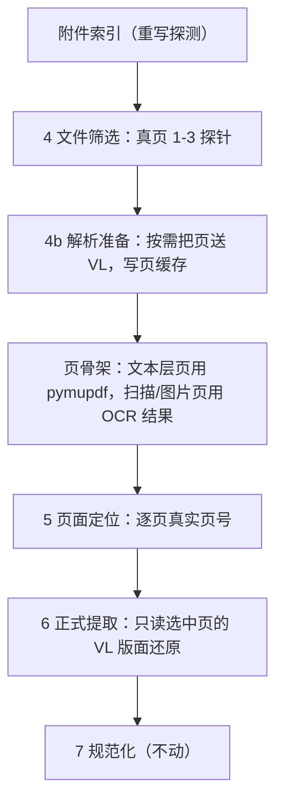

# 附件实时解析打通实施方案（契约 v0.8 草案）

日期：2026-10-02 · 分支 `v1.4-实时OCR` · 对象：主路线第 4、5、6 步与附件索引探测

本文只定"怎么改"，不动代码。落地顺序见第 6 节。

---

## 0. 一句话

把"离线异步把整本 PDF 转成 `work/attachments-md`，回 md 树里找页"换成"按页实时调用 PaddleOCR-VL，结果按页缓存"。第 1 到 3 步、第 7 到 9 步不动；第 4、5、6 步的内容来源全部接到新的解析层，附件索引探测同步重写。

---

## 1. 现在这条路付了什么代价

语料实测（2026-10-02 全量探测 `work/attachments`）：

| 量 | 数 |
|---|---|
| 公告附件目录 | 970 |
| 附件文件 | 13,224（.docx 8,187 / .pdf 4,632 / 图片 240 / .doc 76） |
| PDF 总页数 | 54,433 |
| 文本层可用 PDF | 4,047 |
| 扫描件或无文本层 PDF | 558 个、2,506 页，分布在 351 则公告 |
| 打不开 / 零页 PDF | 21 / 6 |
| 已有 md 孪生 | 80 篇，只覆盖 21 则公告 |

算力上已经不需要这套妥协。端点实测（`_vllm_bench/`）：单页 200 dpi、PNG 0.54 MB，in 1,273 tok、out 351 tok，串行 1.9 s，TTFT 1.1 s，TPOT 2 ms；并发 8 → 2.45 页/s，并发 32～64 → 3.6～4.0 req/s（约 1,400 out tok/s，折 1.5～3 页/s）。一则公告第 5、6 步真正要读的页是 5～15 页，实时解析只多花 3～6 s。全量预热 54,433 页约 5～8 小时；只处理扫描件 2,506 页约 20 分钟。

继续用 md 树，主线上有三处语义错位，而且都还在跑：

1. **第 5 步的"页"是 20 页的块。** `read_document(path)` 返回的是 `<!-- pages 1-20 -->` 这类片段，`PAGE_TEXT_HEAD` 只取块首 300 字。158 页的招标文件在第 5 步只有 8 个"页摘要"，`slim[:80]` 的上限形同虚设。
2. **第 6 步的页号与内容不符。** 请求第 12 页，`read_markdown_pages` 返回第 1-20 页整块并标成 `page_no=12`，再截 6,000 字。候选溯源写的是单页，喂给模型的其实是 20 页，其它包的行会混进当前包。
3. **包范围被系统性放宽。** `page_packages` 在整块文本上数包号，`>= 2` 就把 `package_scope` 改成 `announcement`。多包公告的招标文件块几乎必然命中，第 5 步精心写的包归属规则在转换环节就被抹平了。

留出集卡在这里：`eval/holdout25.json` 25 则，24 则有附件目录且都有 `index.json`，但只有 12 则有 md。没有 md 的 PDF 在 `ensure_markdown` 抛 `paddle_not_connected`，第 5 步整篇记 `no_text_extractable`。过拟合分析里"留出集还没跑过"这个缺口，一半是转换欠的账。

探测本身也有两处错：`index/build.py` 把 `.doc`、`.xls` 直接写成 `text_extractable`，`read_document` 却不支持它们；抽样 33 份 `index.json` 里 50 个 `.docx` 实际是 OLE 老格式，`python-docx` 打不开。

---

## 2. 打通后的流程



三条原则：

- **便宜的钱花在探测上，贵钱花在页上。** 文本层能回答的问题（页数、密度、表头、包号）不再调模型；OCR 只用于扫描件、图片和最终选中页。
- **单一页存储。** 页内容一律从 `PageStore` 取，键为 `(文件 sha256, page_no, model, dpi, prompt_version)`。4b 的扫描页与第 6 步的选中页共用这个存储，重复命中免费，天然断点续跑。
- **形状不变。** 解析层输出的仍是 `{page_no, text, tables, chars}`，第 5、6 步下游代码改动面压到最小。

---

## 3. 新增

### 3.1 模块 `src/ict/parse/`

| 文件 | 职责与关键接口 |
|---|---|
| `render.py` | `pages_of(path) -> int`；`page_image(path, index, dpi) -> bytes`（pymupdf `get_pixmap(dpi=)`，不引入 pypdfium2）；图片附件直接返回原图字节，页号 1 |
| `vl.py` | `VLClient.parse_page(image, prompt) -> PageParse(markdown, tokens_in, tokens_out, ms, finish)`；OpenAI 兼容 `chat/completions`，`temperature=0`，不发送 `response_format` 与 `thinking`；重试 2 次、超时、TLS 自签可配 |
| `store.py` | `PageStore.get(file_hash, page_no)` / `put(...)`；`materialize(targets, concurrency) -> ParseReport`；缓存命中计数、失败页记录 |
| `skeleton.py` | `text_layer_skeleton(path, pages)`（pymupdf `get_text` + `find_tables` 表头）；`ocr_skeleton(page_markdown)`；统一输出页骨架 |
| `markdown.py` | VL 输出的 GFM 表 / HTML 表 → 既有 `{headers, rows}` 形状；非表格部分留作页文本 |
| `config` 扩展 | 见 3.2 |

`src/ict/documents.py` 退化为分发器：`.pdf` 与图片走 `parse/`，`.docx`、`.xlsx` 保留现有实现。

### 3.2 配置（全部读 env，禁止硬编码 URL）

```
ICT_VL_BASE_URL / ICT_VL_API_KEY(可空) / ICT_VL_MODEL
ICT_VL_PROMPT=OCR:            ICT_VL_MAX_TOKENS=4096      ICT_VL_DPI=200
ICT_VL_CONCURRENCY=8          ICT_VL_TIMEOUT=120          ICT_VL_RETRIES=2
ICT_PARSE_ROOT=work/parsed    ICT_PARSE_MAX_PAGES_PER_FILE=40   ICT_PARSE_PAGE_BUDGET=24
ICT_TLS_NO_VERIFY=0
```

`ICT_PADDLE_COMMAND` 删除。`.env.example` 同步补上以上字段清单。

### 3.3 契约与状态文件

- 新增第 4.5 步 `parse_attachments`，输出 `05b_parse_report.json`，登记进 `state.STEP_FILES` 与契约 `steps[].step` 枚举。
- `run_state.counts` 新增 `parsed_pages`、`cache_hits`、`parse_tokens`、`parse_ms`。
- `IndexedFile` 新增：`text_quality`（CJK+字母数字占抽取字符的比例）、`parse_route`（`pdf_text` / `pdf_ocr` / `docx` / `xlsx` / `image` / `legacy_office` / `unknown`）；`page_count` 在去掉 md 短路后恒有值。
- 新增 `PageSkeleton`（`file_id, page_no, chars, head, tables[{headers,row_count}], packages[], source, quality`）与 `ParseRecord`（`file_id, page_no, route, ms, tokens, cache: hit|miss, failure_code`）。
- `Source` 增加 `page_no` 和 `parse_route`：溯源从"文件级"升到"页级"。契约 1.3 第 6 条相应改写。
- 第 7 步之后不动，`07_attachment_extraction.json` 多带 `page_quality`（现在是真页，且带 tokens 与耗时）。

### 3.4 失败码

| 新增 | 含义 |
|---|---|
| `vl_unreachable` | 端点不可用；整步降级，不中断主路线 |
| `vl_page_failed` | 单页解析失败（HTTP 错误或截断 finish=length） |
| `page_render_failed` | 页图渲染失败（损坏 PDF） |
| `ocr_empty_page` | OCR 返回空内容 |
| `ocr_low_confidence` | 页骨架质量低，候选带 `issues` |
| `legacy_office_unsupported` | OLE 老 .doc/.docx 无法解析 |

| 退役 | 原含义 | 替代 |
|---|---|---|
| `unsupported_image` | 图片不进主路线 | 图片是 `parse_route=image`，走 OCR |
| `scanned_or_low_text_pdf` | 扫描件失败 | 变成 `parse_route=pdf_ocr`，正常路径 |
| `no_text_extractable` | 没有 md 且 Paddle 未接入 | 由 `vl_unreachable` / `vl_page_failed` 承担 |
| `watermark_interference` | 水印 | 并入 `ocr_low_confidence` |

### 3.5 提示词

- `triage-files-v1`：说明 `first_pages` 现在是真页 1-3；补一句"文件名与实际格式不符不作为跳过理由"。
- `locate-pages-v1`：删掉"输入不是 PDF 原件，只包含每段 Markdown 的页首和表头"；改成"输入是逐页骨架，`page_no` 必须来自给定列表"；`package_scope` 五条顺序不变，但块级污染消失，`relevance` 阈值需要重新标定。
- `attachment-extract-v1`：说明输入是整页版面还原，表格按行给；强调"同一页出现其它包时只输出当前包的行"；示例继续按过拟合文档 2.4 的要求换成非金标假行。

### 3.6 脚本与测试

| 新增 | 用途 |
|---|---|
| `ict parse <announcement_id> [--file --pages --warm]` | 连通性冒烟 + 单页人工核对，输出页 markdown 与 tokens |
| `prep/warm_parse.py` | 全量或分层预热页缓存，断点续跑，写 `work/parsed/_warm_report.json` |
| `eval/run_holdout25.py` | 与 `run_benchmark10.py` 同形，产出 `work/holdout25/baseline.json` |
| `eval/compare_ab_parse.py` | 同一则公告在"旧 md 路"与"新 VL 路"上的 05/06/07 差异：页数、包范围分布、候选数、字段覆盖 |
| `bench/vl_bench.py` | 由 `_vllm_bench/bench.py` 迁入，改读 env |
| `tests/test_parse_store.py` | 缓存键随 model/dpi/prompt 失效；部分页失败不扩散；并发 materialize 的重试 |
| `tests/test_skeleton.py` | 文本层与 OCR 两条路都产出同形状骨架；页号严格 1-based 对齐 |
| `tests/test_markdown_tables.py` | GFM 表、HTML 表、跨页表拆回 `{headers, rows}` |
| `tests/test_pipeline.py` 扩展 | 用 `FakeVL` 固定页内容，锁住 9 步契约不变 |

---

## 4. 摒弃

| 对象 | 位置 | 处理 |
|---|---|---|
| 离线转换脚本 | `work/convert_logics_attachments.py`（公开 Logics 服务、20 页切块、SSE 轮询、`PAGE_LIMIT=20`） | P4 删除；先在 `doc/archive/` 留档 |
| md 树读写 | `documents.py`：`PAGE_MARK_RE`、`_markdown_segments`、`read_markdown_pages`、`read_pdf_pages`、`ensure_markdown`、`convert_with_paddle`、`markdown_path_for_pdf`、`MarkdownUnavailable` | 整组删除，由 `parse/` 取代 |
| `ICT_PADDLE_COMMAND` | `config`、`.env`、契约第 164、315、889、1012 行相关表述 | 删除 |
| md 短路探测 | `index/build.py::_probe_pdf` 里"有 md 就记 `text_extractable`、`page_count=None`" | 删除，一律 pymupdf 真探测 + `text_quality` |
| `work/attachments-md/` | 80 篇 md、27 张 jpg、970 个空目录 | 空目录即刻清；有内容目录冻结到 `work/archive/attachments-md-202609/` 供 A/B，P4 删 |
| `work/runs-attachments/` | 转换脚本的 SRC（45 个 pdf），主线不读 | 与转换脚本一起退场 |
| 第 6 步截断 | `text[:6000]`、`tables[:4]`、每组 `>12 页`直接丢弃并记 `page_context_truncated` | 换成按页预算切多次调用，不丢页 |
| `source_type = "pdf"` 硬编码 | `s04_attach.extract_attachment_candidates` | 改为真实扩展名/`parse_route`，docx 与图片候选不再冒充 pdf |
| 页级丢弃 | `chars < 20` 直接跳过页；`page < 20` 判定 | 换成 `ocr_empty_page` / `text_quality` 判定 |
| 旧上限常量 | `MAX_PAGES_PER_FILE=30`、`MAX_PAGES_PER_ANNOUNCEMENT=100`、`slim[:80]`（按"块"标定） | 按真页重新标定 |
| 错误测试 | `test_missing_markdown_is_paddle_not_connected` | 换成 `test_vl_unreachable_records_failure` |
| 契约排除项 | §1.2「扫描版 PDF／图片／水印不进主路线」与 §11 的 OCR、图片分支表 | 改为"实时解析属主线"，§11 只留仍未覆盖的分支 |
| 常量重复 | `s04_attach.CLASS_PRIORITY` 与 `config.SOURCE_PRIORITY`、`FILE_CLASS_PRIORITY` 三份 | 合并成一份 |

删除纪律：先加新层并跑通 A/B，再删调用点，最后删数据树。任何一步失败都能回退到上一步，不做双向兼容层。

---

## 5. 打通后的四条关注线各自变成什么

| 关注线 | 改造前 | 改造后 |
|---|---|---|
| 探测 | 有 md 即算可读，页数缺失，`.doc`/OLE 误标 | 真页数 + 文本密度 + `text_quality` + `parse_route`；不可读不再靠猜 |
| 转化 | 整本异步转 md，20 页一块，覆盖 21/970 | 按需单页实时转化，页级缓存，覆盖到实际选中的页 |
| 筛选 | 块首 500 字 + 块内表头 | 真页 1-3 的 markdown 与表头；图片和扫描件进入筛选而不是先判死刑 |
| 正式提取 | 20 页块截 6,000 字，包范围放宽，溯源写文件级 | 单页版面还原进模型，包范围按真页判定，溯源到页 |

---

## 6. 分期与验收

| 期 | 内容 | 验收 |
|---|---|---|
| P0 | 连接方式落地：env 字段、`vl.py`、`ict parse` 冒烟；跑 `_vllm_bench` 同页 3 次核对 markdown 质量 | 拿到 3 个样本页（文本层、扫描件、图片）的稳定 markdown；并发 8 与 32 的 req/s 复现 |
| P1 | `PageStore` + `skeleton` + `markdown` 三件；新探测写入 `IndexedFile` | 单测通过；对 9 则已转换公告逐页对比，页号 100% 对齐，无块错位 |
| P2 | 第 4、4b、5、6 步接到新层；契约升到 v0.8；`A/B 对比` | benchmark10 名称 74/74、供应商 61/61 不退；`package_scope=announcement` 的比例明显下降；新增 `vl_*` 失败为 0 |
| P3 | 跑 `holdout25`（此时不再需要预转换） | 25 则全部跑通并产出 baseline；错误按"词表窄／词表宽／模型波动"三类归档，只统计不回改 benchmark |
| P4 | `warm_parse.py` 预热全量；删转换脚本与 md 树；`server/` 上传触发真实管线 | 全量运行报告 + 监控表；`grep -r attachments-md src/` 为空 |

容量预算（P4 前定）：按并发 8、1.5～2.5 页/s，一则公告 8 页约 4 s，1,038 则的选中页约 8,300 页、1 小时；加扫描件 2,506 页约 20 分钟；若要"全量 54,433 页全 OCR"留作后续检索语料，约 6～8 小时，可分批夜间跑。

纪律（承接过拟合文档 2.4）：P2 只换内容来源，不碰规则、阈值、否决词和示例；规则改动必须在 P2 的 A/B 结论出来之后单独提 PR，否则分不清变化来自解析还是规则。benchmark10 的 10 则自此冻结。

---

## 7. 还需要你给的东西

1. 服务器连接方式：基础 URL 或 SSH/内网隧道、端口、是否自签 TLS、鉴权方式（`_vllm_bench/bench.py` 里那个地址我不确定是否还是当前这台）。
2. 服务端模型名与 `/v1/models` 返回；是否只支持 `OCR:` 一种提示词，还是 `Table Recognition:`、`layout parsing` 等分开。
3. 页图上限（最大像素、最大 token、`max_tokens` 默认值）和你能接受的并发数，用来定 `ICT_VL_CONCURRENCY` 与页预算。
4. 是否允许 P4 的夜间全量预热；OLE 老 `.doc`（76 个 + 50 个伪装成 `.docx`）要不要在服务器上装 LibreOffice 走 `.doc → PDF → OCR`。
