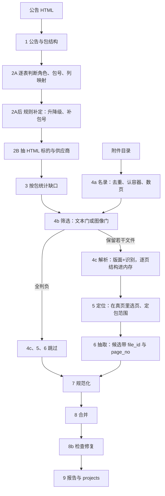

# 主路线当前流程与风险（已归档·串行版）

> **本文已于 2026-10-06 归档，只作历史记录，不要再作为现状依据。**
> 归档原因：它描述的是**全程串行**的执行形态，其中
> 第 3 节「时间花在哪」是串行实测、第 4 节第 7 条「全程串行 + 服务并发受限」是被本次并发改造
> 直接推翻的一条；第 4 节第 6 条「未复验的改动」也已由用户实测关闭。
> 现存流程、并发架构与验收方法见 `eval/主路线实现细则.md`；待办见 `eval/待优化清单.md`。
> 本文第 2 节「逐步在做什么」仍是对九步语义的准确叙述，可作背景阅读。

日期：2026-10-02 起草，2026-10-03 随「A 组信息传递改造」更新。分支 `v1.4-实时OCR`。以当时的 `src/ict/pipeline.py` 为准。
本文描述流程；逐步的模型输入输出与每条判定的代码位置见 `eval/主路线实现细则.md`（1～6 步）与 `eval/后续步骤核对清单.md`（7～9 步）；待办集中在 `eval/待优化清单.md`。
本文取代 2026-09-28 那份的附件部分：那一份里"整本 PDF 异步转成 `work/attachments-md`，再回 md 树找页"的路径已删除。
全文用一则真实公告贯穿：**t20260202_26140146 济宁市第二人民医院信息化能力提升采购项目**（HTML 只给出"详见附件"，标的必须从附件拿）。

---

## 0. 先统一叫法

同一个东西有三种历史叫法（契约步骤号、代码里的 step 名、讨论时的 4a/4b/4c）。本文只用第一列。

| 本文步骤 | `run_state.json` 里的 step 名 | 产物文件 | 判断者 |
|---|---|---|---|
| 1 公告与包结构 | `understand_announcement` | `01_announcement_understanding.json` | 大模型 |
| 2A 表格理解 | `understand_html_tables` | `02_html_tables.json` | 大模型 |
| 2A后 规则补定 | 同上（覆盖写） | 同 `02` | 规则 |
| 2B HTML 候选 | `extract_html_candidates` | `03_html_candidates.json` | 大模型 |
| 3 缺口规划 | `plan_project_gaps` | `04_project_plans.json`（含每包的 `needs`） | 规则 |
| 4a 附件名录 | `build_index`（在流程外先跑） | `work/attachments/<公告>/index.json` | 规则 |
| 4b 文件筛选 | `triage_files` | `05_file_decisions.json` | 大模型 |
| 4c 附件解析 | `parse_pages` | `05b_parsed_pages.json` + 内存 | 视觉模型 |
| 5 页面定位 | `locate_pages` | `06_page_decisions.json` | 大模型 + 规则兜底 |
| 6 附件抽取 | `extract_attachment_candidates` | `07_attachment_extraction.json` | 大模型 + 规则 |
| 7 规范化 | `normalize_candidates` | `08_normalized_candidates.json` | 规则 |
| 8 合并 | `merge_candidates` | `09_merged_projects.json` | 规则 |
| 8b 检查修复 | `repair_packages` | `09`（覆盖写） | 规则 + 至多一次大模型 |
| 9 报告 | `persist_and_report` | `10_run_report.json`、`projects.json` | 规则 |

---

## 1. 全图



第 3 步判定所有包都不缺字段，或没有附件目录时，4b 之后全部跳过。

---

## 2. 逐步在做什么

### 1 公告与包结构

- **输入**：HTML 抽出的骨架——概要 6 个字段（项目名称、品目、采购单位、总中标金额、总成交金额、评审专家名单）、章节标题、至多 12 张表的表头与样例行、至多 40 条包线索。
- **处理**：大模型读，输出 `project_name`、`package_mode`（单包/多包/不清）、每包 `package_no` 与 `package_amount`。枚举不合法时带错误重试一次。
- **本例输出**：`project_name=济宁市第二人民医院信息化能力提升采购项目`，`package_mode=multi`，包 B 金额空。
- **失败**：包结构不清或缺项目名 → 整个运行 `failed`。

### 2A 表格理解 + 规则补定

- **输入**：每张表单独一次调用（表前文字、所在章节、表头、样例行、已知包号）。
- **处理**：大模型给 `table_role`（成交明细/汇总/得分/中标/代理费/其他）、`row_grain`、列映射。随后规则覆写：表头含"得分/业绩/甲方/竣工/文件名称"等词的表降级为其他；章节含"主要标的/标的信息/采购内容"或键值格恰是"名称/服务范围/货物名称"的表提升为明细；再用供应商锚点、品目号第一段补包号，仍不确定则整篇一次模型。
- **判断者**：模型 + 规则，规则有最终否决权。

### 2B HTML 候选

- **输入**：角色不是"其他/代理费"的每张表的全部行 + 列映射；"中标信息""评审专家"这类正文另调一次。
- **输出**：`cob`/`sub` 候选，来源 `html`。字段名由规则纠偏（`货物名称→object_name`、`综合得分→score`）。
- **本例输出**：只有 4 个候选，标的名是"护理信息化系统"这一行，品牌、规格、单价、数量全是"详见附件"。

### 3 缺口规划（纯规则）

- **输入**：第 1、2 步结果 + 有没有附件目录。
- **处理**：按包统计每个字段覆盖率，算出 `missing_fields` 与 `suspects`，决定 `needs_attachment`，并给第 5 步准备检索词。
- **本例输出**：包 B `needs_attachment=true`，缺 `brand/spec_model/unit_price/quantity/total_price/category_name`，疑点 `field_points_to_attachment`，检索词 `["第B包 分项报价", "护理信息化系统"]`。

### 4a 附件名录（纯规则，不看内容）

- **输入**：`work/attachments/<公告ID>/` 下全部文件。
- **处理**：读前 16 字节确认真实文件类型（不信扩展名）、sha256 去重、PDF 数页数、标注 `native_readable` 与 `needs_normalisation`。
- **本例输出**（`index.json` 第一条）：

  ```json
  {"file_id":"a001","display_name":"B包业绩一览表.pdf","page_count":1,"text_density":405.0,
   "fmt":"pdf","digest":"294bc6…","native_readable":true,"needs_normalisation":false}
  ```

  本例 5 个文件类型都是 pdf，无字节重复；页数依次 1、1、1、1、145，其中 a004 无文本层（名录里 text_density 为空）。
- **为什么先做这一步**：全量语料 13,225 个文件里按内容去重只有 7,560 个唯一，127 个 OLE 伪装成 `.docx`。名录让后面每一步都有稳定的 `file_id`、真实页数和需不需要服务器端的Paddle模型。

### 4b 文件筛选（大模型判定哪些文件可能包含我们需要的内容）

- **输入**：名录条目 + 每个文件的部分内容 + 第 3 步的 `needs`（本公告还缺什么，含"公告标的清单可能不全"这一条）。不同文件类型的选择方法不同：`.docx` 用 python-docx 读正文段落与前几张表；`.pdf` 用文本层；`.xlsx` 用 openpyxl 读单元格；取前 3000 字。取不到文字的文件改用图：PDF 渲染首页与中间页（130 dpi JPEG）、`.docx` 取 `word/media/` 前 2 张、图片文件用自身。
- **处理**：一次模型调用，问一句话——这个文件里有没有"一行一个标的、带单价/数量/总价"的行项，输出四个字段：

  ```json
  {"kind":"bid_quote","has_price_table":true,"header":"序号|产品名称|品牌/型号",
   "found_fields":["unit_price","total_price"],"confidence":0.95}
  ```

- **判定表**：

  | 4a 已知情况 | 走哪条 | 送什么 | 判断者 |
  |---|---|---|---|
  | 有文字层（pdf/docx/xlsx） | 文本门 | 3000 字 + 前 3 个表头 + 文件名/格式/页数 | DeepSeek 文本 |
  | PDF 无文字层（扫描件） | 图像门 | 首页 + 中间页缩略图 | DeepSeek 多模态 |
  | docx 正文近乎空但有内嵌图 | 图像门 | `word/media/` 前 2 张图 | DeepSeek 多模态 |
  | 图片文件（png/jpg） | 图像门 | 图本身 | DeepSeek 多模态 |
  | OLE（`.doc`、伪装 `.docx`） | 本地读不动，直接留给 4c 转换 | — | 规则 |

- **保留条件**：模型回答的 `found_fields` 与 `needs` 有交集就解析，没有交集就判负；`needs` 本身为空一律解析（没目标可找，不能据此丢文件）。`kind`、`confidence` 只留痕，不参与取舍。
- **唯一按名字判负的规则**：文件名含「中小企业声明函」或「残疾人福利」，在看图之前直接丢，不送模型（`screen.NAME_IGNORE`，仅此两词）。
- **本例输出**（`05_file_decisions.json`）：

  | 文件 | 走的路 | 决定（2026-10-02 那次跑，按旧的 `kind` 白名单） |
  |---|---|---|
  | a001 B包业绩一览表.pdf | 文本门 | 判负（历史业绩表） |
  | a002 B包中小企业声明函.pdf | 文本门 | 判负（现在会先被名字规则拦下，不送模型） |
  | **a003 B包分项报价表.pdf** | 文本门 | **保留** |
  | **a004 劳务报酬表.pdf** | 图像门 | **保留**（旧规则靠低置信放行；新规则改看 `found_fields`，待重跑确认它会被判负） |
  | a005 采购文件正文.pdf（145 页） | 文本门 | 判负 |

  文件名词表只留下 `name_rule` 字段做记录，没有否决权：`name_rule=target` 的 a001 被模型判负，`name_rule=junk` 的 a004 反而被模型保留。判定式改成 `needs_hit` 之后这五个文件的取舍还没重跑复验。
- **成本**：中位 0.7 秒、1.4k token/文件，本机执行，不占 GPU。

### 4c 附件解析（服务器端视觉模型）

- **输入**：4b 保留的文件。
- **处理**：`docx`/`xlsx` 本机原生读（不转 PDF、不栅格化）；其余发到服务器（GPU 实例，6008 服务）：OLE 先 `soffice` 转 PDF，再走 PaddleOCR-VL-1.6 管线（版面检测 + 每个版面块一次识别 + 官方 `restructure_pages` 跨页合表），每文件上限 40 页。返回 JSON 由 `client.as_pages()` 转成 `{page_no, text, tables, chars}`。
- **本例输出**（`05b_parsed_pages.json`，只存摘要不存正文）：

  ```json
  {"file_id":"a003","name":"B包分项报价表.pdf","pages":1,"chars":123,"tables":1,
   "table_headers":{"1":[["序号","产品名称","品牌/型号","技术参数、配置","制造商","产地","数量","单价","总价"]]}}
  ```

- **当前状态**：**没有任何缓存**。重跑同一则公告，OLE 会再转一次、PDF 会再解析一次；`persist=False` 也就等于零复用。落库形态下的 `parse_cache` 见 `eval/待优化清单.md` E1。
- **实测**：稳态 4.45 秒/页，本例 2 页花 12 秒。

### 5 页面定位

- **输入**：4c 已解析页的逐页骨架——真页号、`text_head` 前 300 字、表头、行数、首行样例、每页表格个数、字符数；文件级带真实名、4b 定的 `file_class`、4b 目检命中的 `found_fields`、文件名唯一指明的 `possible_packages`；再加第 3 步的 `needs` 与公告已知包号。**检索词已不再送模型**（2026-10-03）。
- **处理**：大模型选页并给 `package_scope`；规则兜底把公告里不存在的包号收回（先本文件唯一包号，再文件名包号，再公告只有一个包，否则 `unknown`）、一页命中两个以上包号时降为整篇范围。每个文件最多送 `PAGE_LOCATE_LIMIT=80` 页，选中的页每文件最多 30 页、每则最多 100 页。
- **本例输出**（`06_page_decisions.json`）：a003 第 1 页 `package_scope=B`、`extraction_mode=text_and_table`、相关性 0.95；a004 第 1 页 `extraction_mode=unsupported`（模型认出那是评审劳务报酬支付表），相关性 0.1。
  这条链条正是想要的方向：门保守放行 → 定位否掉 → 不产出候选，代价 1 页解析。

### 6 附件抽取

- **输入**：第 5 步选中的页按 `package_scope` 分组后的上下文（每页带真实页号、正文、表格行、以及 4b 在该文件里看到的 `found_fields`），外加当前包的 `missing_fields` 与 `needs`。**注意：同一组内的页可能来自不同文件、彼此不相邻**；每组最多 12 页一次调用（`PARSE_RUN_PAGES`），所以跨页表若被分到不同组，行仍可能被拆开。
- **处理**：大模型抽 `cob`/`sub`，并把页面原文单独写出的包级总额抄进 `package_amounts`；规则做字段别名纠偏、包号回退（当前包 → 文件名里的包号）、按文件类别定 `source_priority`（类别取不到时用 `DEFAULT_FILE_CLASS`/`DEFAULT_SOURCE_PRIORITY`），并把 `page_no` 写进候选来源。每页送正文前 `PAGE_CONTEXT_CHARS=6000` 字、最多 `PAGE_CONTEXT_TABLES=6` 张表。
- **本例输出**（`07_attachment_extraction.json` 第一条）：

  ```json
  {"entity":"cob","pkg":"B","source":{"source_type":"pdf","file_id":"a003","page_no":1},
   "class":"bid_quote","fields":{"object_name":"HIS子系统升级","brand":"新蓝海","spec_model":"按照招标要求提供",
   "unit_price":"400000.00","quantity":"1","total_price":"400000.00"}}
  ```

  7 个候选全部来自 a003 第 1 页。

### 7 规范化（规则）

价格去符号与万元换算、数量与单位拆分、品目按 `procurement_catalog_2022.json` 匹配、联合体清洗。HTML 与附件候选合并处理，11 个进、11 个出。

### 8 合并（规则）

清单归属（HTML 明细封闭 vs 附件开放）→ 名称聚类 → 价格四字段整组取自同一候选（单价×数量与总价偏离 >5% 的组不用）→ 行总价与包金额对账（超 8% 换组）→ 单标的无价格时取公告包金额。包金额若只存在于附件原文里，由第 6 步的 `package_amounts` 观测补上（只在缺失时填，且不参与对账）。**本例**：附件行替换 HTML 的"详见附件"行，清单归附件，包金额 1,486,000 与 7 行之和一致。

### 8b 检查修复（规则 + 至多一次模型）

缺标的/缺中标人/行金额不符/金额超 8% 为硬检查；缺中标人用正文中标章节锚点补；价格问题把已有价格组交给模型选一次，只有严格变好才接受，否则回退。硬与中检查仍在 → 运行标 `partial` 待复核。

### 9 报告

`10_run_report.json` 记状态、耗时、每步调用数、失败码汇总；`projects.json` 是给前端的正式结果。**本例**：`success`，7 个标的、3 个供应商（中标人 山东新蓝海科技股份有限公司 89.74 分），25 秒、11 次模型调用、解析 2 页、失败 0。

`persist=False` 时上面所有 JSON 都不写盘，`projects` 直接在返回对象里；`RunReport.projects` 不参与序列化，`10_run_report.json` 内容不变。

---

## 3. 时间花在哪

10 则金标合计 251 秒，均值 25.1 秒/则（`run_state.json` 时间戳，1 秒分辨率）：

| 阶段 | 合计 | 占比 |
|---|---|---|
| 2A + 2B（逐表调 DeepSeek，串行） | 116 s | 46% |
| 4c 解析（GPU 侧全部工作） | 78 s | 31% |
| 4b 筛选（逐文件串行） | 23 s | 9% |
| 1 公告理解 | 16 s | 6% |
| 5 + 6 | 18 s | 7% |
| 3、7、8、8b、9（纯规则） | ≈0 | — |

解析只落在 6 则上（26、20、12、10、5、5 秒），另外 4 则为 0——其中 27275031 有 49 个附件却一个没解析，32 秒全在 DeepSeek 上。所以服务器 GPU 只有零星短峰值是符合结构的：一则公告通常解析 1 到 4 页，每页 4.45 秒（版面一次 + 每个版面块各一次识别），其余时间进程在等文本模型。参照系：同一页裸打 `Table Recognition:` 只要 1.1 秒，管线贵出的 3 到 4 倍就是"逐块识别"。

---

## 4. 当前风险

1. **没有缓存与复用**（最大的一条）。4c 每次重转重解析。生产形态（`persist=False`）因此是零复用：同一份模板件在两则公告里付两次钱。解法是 Postgres 建 `parse_cache(digest, libreoffice_version, page_no, prompt, markdown, tokens, ms)`，不是建目录树。
2. **归一化权威未定**。同一份 docx，本机 LibreOffice 26.2.6 转出 68 页，服务器 7.3 转出 66 页（另一份 56 对 51）。页号语义取决于"谁转的"，混用会让第 5、6 步与候选溯源整体错位。当前主流程只在服务器转。
3. **门是单点判定且会翻转**。同一个文件两次运行 `found_fields` 可能不同（实测 21～23 份里就有 1 例翻转：`合同包1：开标记录表.pdf`）。置信度阈值已按指示取消，翻转只能靠重跑与人工复核吸收。门的判准目前只在 20 多份文件上验过，留出集 25 则未跑。
4. **官方合表保守**：6 页报价明细表合并后是 `[9,0,5,11,0,0]`，行没丢但一张表会拆成两块；若第 5 步把相邻两块选散到不同调用，价格行可能被腰斩，进而让第 8 步包金额对账换错价格组。
5. **4b 已放弃名称否决**，`config.SCREEN_DROP_KINDS` 留空。哪些类别（承诺书、声明函、报酬支付表）可以安全按名字筛，必须由全量数据分析给出——放优化阶段，现在不猜。
6. **未复验的改动**：A 组传参改造（`needs` 语义、`found_fields` 下传、`possible_packages` 填充、去检索词）之后，金标 10 则一次都没重跑；26139917 那 4 个 `unassigned_candidates` 是否消失也还没验证。
7. **全程串行 + 服务并发受限**：门逐文件、解析逐文件、DeepSeek 逐表；且 6008 的 `/parse` 写成 `async def` 却跑同步阻塞调用，一个 worker 同时只能处理一个解析，并行只能靠多进程，而进程一多就线程超订（曾见 load 44 对 10 核）。
8. **过拟合面没有缩小**：2A 否决词、8%、5%、80% 仍出自这 10 则；留出集 `holdout25` 仍未跑；新增的门阈值也只有 16 份样本支撑。需要更多金标数据。
9. **docx 原生读看不见图片型表格**。唯一兜底是"正文近乎空且有内嵌图才走图像门"；若行项藏在一张正常正文后的截图里，现在抓不到，且没有样本证明这类情况有多常见。
10. **数据缺口**：26142958 无附件目录（`attachment_index_miss`）；留出集 25 则中 24 则有附件但未跑；全量 970 个附件目录里 558 个 PDF 是扫描件，尚未过门验证。
