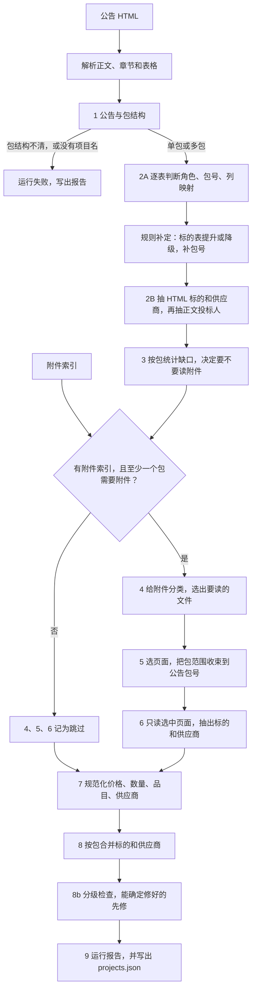
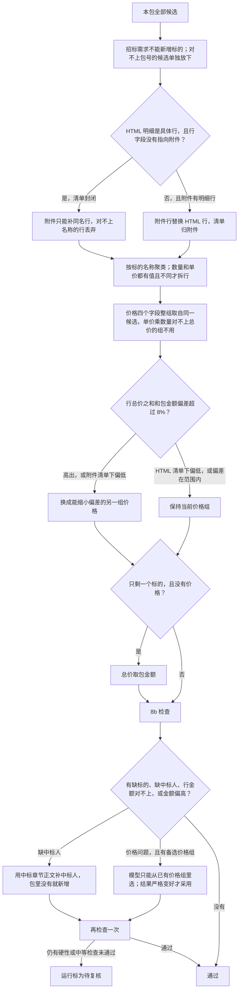

# 主路线流程与过拟合风险

日期：2026-09-28
对象：分支 `v1.2`，契约 v0.7。流程以 `src/ict/pipeline.py` 为准。过拟合判断针对 benchmark10 这 10 则金标，留出集 `eval/holdout25.json` 尚未跑过。

---

## 1. 主路线怎么走

单则公告走一条流水线：读 HTML 和附件索引，每步写出一个 JSON，最后得到 `projects.json` 和运行报告。

第 1 步包结构不清、或没有项目名时，运行直接失败。没有附件索引，或没有任何包需要附件时，第 4 到第 6 步记为跳过，后面的规范化、合并和检查照常进行。

| 步骤 | 做什么 | 输出 |
|---|---|---|
| 1 | 判断公告类型、单包还是多包、包号和包金额 | `01_announcement_understanding.json` |
| 2A | 每张表判断一次；之后用规则提升或降级标的表，并补包号 | `02_html_tables.json` |
| 2B | 可抽取的表各调用一次；投标人正文最多再调用一次 | `03_html_candidates.json` |
| 3 | 不调用模型，按已有字段决定每个包是否读附件 | `04_project_plans.json` |
| 4 | 给每个附件分类，决定跳过还是读指定页 | `05_file_decisions.json` |
| 5 | 在选中的文件里定位页面；一页出现两个以上包号时按全公告处理 | `06_page_decisions.json` |
| 6 | 按包范围分组，只抽取选中页面 | `07_attachment_extraction.json` |
| 7 | 把价格、数量、品目、供应商收成可比的值 | `08_normalized_candidates.json` |
| 8 | 决定清单归 HTML 还是附件，再合并成包 | `09_merged_projects.json` |
| 8b | 检查后做有限修复，结果写回同一文件 | `09_merged_projects.json` |
| 9 | 汇总状态、耗时、调用次数和失败码 | `10_run_report.json`、`projects.json` |

第 8 步和第 8b 步决定清单归属、价格组和中标人，规则比前面的抽取步骤更密。

---

## 2. 会不会过拟合这 10 则金标

会有过拟合风险。这 10 则上标的名称 74/74、供应商 61/61，只能说明当前规则覆盖了这 10 则，不能说明换一批公告还成立。

代码里没有按公告 ID 分支，第 1 步到第 9 步的骨架可以迁移。收紧过的判定边界、否决词和提示词示例，是对着这 10 则金标一次次改到对上的。留出集还没跑过，所以这个风险现在无法被这套测试否定。

每种角色在这 10 则里只有 1 篇。规则是看到这篇的错误才加上的，单测又用同一篇的形态来锁住规则。测试通过只说明规则没被改坏，不说明规则在下一篇上仍然对。

### 2.1 提示词把金标原文当成了示例

`html-candidates-v1`、`html-tables-v1`、`attachment-extract-v1` 里的例子就是这 10 则里的行：团体重大疾病保险、口腔种植手术机器人、潜伏式搬运机器人、HIS子系统升级，以及「88.33（84.50、92.50、88.00）」这组分数。模型在基准集上等于见过目标行的写法。

这些例子教的拆分方式可以迁移：品目编码和名称分开，括号前的数字是综合得分，括号里并列的数字是评委分数。标的名称和具体分数不该来自金标。不确定包号时，模型还可能照抄示例里的 `"1"` 或 `"B"`。

### 2.2 对着这 10 则裁出来的边界

| 规则 | 它修好的那一则 | 留出集上可能偏的方向 |
|---|---|---|
| 标的表否决词：业绩、得分、联系、甲方、竣工、文件名称 | 工程维护里的往年业绩表、详见附件里的文件列表 | 表头里真有「得分」「联系人」「业绩要求」的标的表会被降掉 |
| 单元格不超过 20 字且含「详见」才算指向附件 | 详见附件 | 「详见采购文件第五章」这种长句不会开放清单，附件明细进不来 |
| 名称被项目名包含且长度不少于项目名的 80% 就当项目行删掉 | 工程维护的往年项目全称 | 标的名几乎等于项目名时，真实行会被删掉 |
| 只有一个标的且没有价格时，总价取包金额 | 无附件的 A/B/C、包号 A | 包金额里还含没列出的费用时，这一行总价会被填大 |
| HTML 封闭清单的金额偏低只记软检查 | 货物分号多值的包 3 | HTML 真漏了行时不会进入待复核 |
| 一页出现两个以上包号就改成全公告范围 | 服务两包的「合同包1」「合同包2」 | 「包」字旁边的无关编号会被当成第二个包；「标段一」「第一包」又识别不到 |
| 去掉含「成员」的括号再合并供应商 | 服务两包里「联投体 / 联合体」 | 牵头人、联合体写在括号外时合并不了 |
| 中标表里名称必须占满一个单元格才强制标中标 | 紧凑货物那张包住整页的排版表 | 名称和地址写在同一格时，强制标记不会生效，又回到看模型 |
| 投标供应商列里的值不能当产品供应商 | 货物分号多值，模型把中标人填进了制造商 | 这一列其实是制造商、却被映射成供应商时，真值会被清空 |
| 行总价之和偏差超过 8% 就换另一组价格 | 保险，换完后与包金额分毫不差 | 另一组是预算价或别的投标人报价时，会为了凑金额换错 |

8% 和 5% 没有在这 10 则以外标定过。保险那则换组后差额是 0，所以 8% 对它来说很松，换任何更严的阈值结果也一样。阈值是不是合适，这 10 则看不出来。

### 2.3 过拟合较轻的部分

这些规则约束的是结构，不是某一则的措辞：

- 价格四个字段必须来自同一候选。
- 单价乘数量对不上总价的组不用。
- 招标需求不能新增标的。
- 清单只有在行字段指向附件时才对附件开放。
- 第 8b 步只能从已经抽出的价格组里选，而且检查必须严格变好才接受。

留出集上仍可能选错组，但不会制造出原文里没有的金额。工程维护的评委分数之和没有改成金标的空值，这一处是故意没去贴金标的。

### 2.4 建议

把这 10 则冻住，不再按它们的新错误改规则。先把提示词示例换成金标里没有的假行，再把 `holdout25` 原样跑一遍。跑完只把错误分成三类再决定改不改：词表或阈值太窄、太宽，以及模型波动。后一类用确定性兜底，不要再加一条只对某一则成立的正则。
