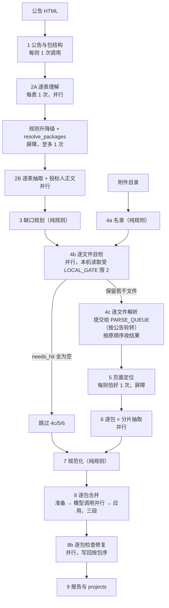

# 主路线实现细则：并发流水线 + 模型输入输出 + 每条规则的依据

日期：2026-10-06（并发改造完成）。以当前工作树的 `src/ict/pipeline.py` 为准。

分工：九步的输入输出契约见 `doc/主路线多步Agent设计契约.md`；第 8 步的判定与审计细则见
`doc/第8步标的合并规范.md`；按位置清点规则见 `eval/archive/规则清单.md`（已归档，只作排查记录）；
唯一待办出口是 `eval/待优化清单.md`；**怎么启动、有哪些参数可调**见 `eval/启动参数与运行指南.md`。
本文按"谁在判断、依据什么、能不能并发"展开。
规则区处于冻结状态（见 `AGENTS.md`）——**本文所有并发改动都没有触碰任何词表、阈值、枚举或判定分支。**

约定一：所有对话模型调用都走 `ict.llm.complete_json`——`temperature=0`、`response_format=json_object`、
`thinking:disabled`、无对话记忆（每次只喂当步 JSON）；输出非法时带错误信息重试一次，两次都失败才记
`llm_schema_invalid`。第 8 步例外，它开思考且不带 `response_format`（见 §四.10）。

约定二（2026-10-03 实装）：字段语义只有一个来源——`src/ict/fields.py`。`llm.load_prompt()` 在每份提示词
正文后追加一段「字段含义」，内容由 `STEP_FIELDS` 声明的该步输入字段 + 输出字段生成；步骤专属取值表放
`STEP_FIELD_OVERRIDES`。9 份 `.md` 不再手写字段定义，同一步内同一字段不重复解释。

约定三（2026-10-06 实装）：并发只改变"同一时刻有多少个调用在飞"，不改变任何一步的判定。
所有并行点都**按原始顺序回填结果**，调用次数一次不增一次不减；`cand_%06d` 的发号仍在父线程完成。
可并发单位与保序契约见 §二。

---

## 一、全流程图（并发版）

与最早的串行版相比，变化只在"同一时刻能有多少件事在飞"上：形状（步骤、屏障、判定者）一步没动。



图里有四道**不可并行的屏障**（流程在它们之前必须等齐）：

1. `1 → 2A`：没有包号列表，单表理解无从校验。
2. `2A 全部 → 规则补定 → resolve_packages → 2B`：包号的决定是公告级的。
3. `4c 全部 → 5`：**第 5 步是每则一次调用**，必须等本则所有保留文件都解析完；这一步无法在公告内部并行，
   只能靠公告之间重叠来掩盖（见 §二）。
4. `6 全部 → 7 → 8`：规范化与合并都要看到全部候选。

Step 1 与 Step 5 每则各只有一次调用，是公告内部的天然串行点；这两处的等待只能靠"同时处理多则公告"填满。

## 二、并发执行模型

### 2.1 三道闸门（`src/ict/concurrency.py`）

| 闸门 | 默认 | 保护的东西 | 被谁用 |
|---|---|---|---|
| `LLM_GATE` | `ICT_LLM_MAX_CONCURRENCY=8` | 对话模型端点。所有步骤、所有公告共用一把 | `llm.OpenAICompatibleClient._send_once`，重试的每一次尝试都单独取一次 |
| `LOCAL_GATE` | `ICT_LOCAL_HEAVY_WORKERS=2` | 目标机（2 核）上真花 CPU 的活 | `peek.peek_entry`、`peek.page_profiles`、`screen.thumbnails`、`documents.read_native` |
| `PARSE_QUEUE` | `ICT_PARSE_MAX_INFLIGHT=3` | GPU 解析服务。**按公告轮转的队列**（不是 FIFO），默认同时 3 份文档 | `s04_attach.parse_pages` |

**`ICT_PARSE_MAX_INFLIGHT` 的定值依据**（2026-10-06，真实 10 则公告、服务器不变，端到端墙钟）：

| N | `--workers` | batch wall | 相对 N=1 | batch cpu |
|---|---|---|---|---|
| 1 | 2 | 467.8s | 基准 | 5.3s |
| 1 | 4 | 461.0s | −1% | 5.7s |
| 1 | 8 | 478.1s | +2% | 7.4s |
| 2 | 2 | 317.3s | −32% | 8.1s |
| 2 | 4 | 298.8s | −36% | 8.7s |
| 2 | 8 | 274.9s | −41% | 8.2s |
| **3** | **4** | **276.4s** | **−41%** | 8.5s |
| 3 | 8 | 269.0s | −42% | 7.5s |

三条读出来的东西：

1. **N=1 时加公告线程几乎没用**（−1% / +2%）——所有公告都挤在同一个单文档队列后面，
   这正是"队头阻塞"的宏观表现。
2. **N=2 之后公告并发才开始生效**（317→299→275）：队列不再是一根独木桥，
   多个公告才真能同时在飞。
3. **N=3 相对 N=2 只再多 8%，N=3 与 N=3/8 线程差 2.6%**，说明 GPU 引擎在 2～3 份文档时已接近饱和。
   所以取 **N=3 / workers=4**：再往上（8 线程）只快 2.6% 却多占一倍在途状态，不划算。

**代价**：`batch cpu` 从 5.3s 升到 8.5s（编排开销 +60%），换 −41% 墙钟——完全值。

**由此产生的部署耦合（重要）**：N=3 意味着**服务端必须能同时处理 3 个 `/parse` 请求**。
服务端 `/parse` 是 `async def` 但内部是同步阻塞体，**单个 uvicorn worker 同一时刻只处理一个请求**；
如果服务端退化成单 worker，这三份文档只会在服务端门口排队，上面 41% 的收益会消失，
而客户端看不出任何异常。所以服务端 worker 数与 `ICT_PARSE_MAX_INFLIGHT` 必须一起看。

`ParseQueue` 的调度规则（2026-10-06）：每个公告是一个 owner，owner 内部保持先进先出，调度器在
owner 之间轮转。一个公告先提交 10 个文件、另一个后提交 1 个时，出场顺序是
**A1 B1 A2 A3 … A10**——大的那则总完成时间不变（GPU 总工作量没变），小的那则不再排在 10 个后面。
owner 内部仍按 `FileDecisions` 的优先级顺序，所以每则最可能含答案的文件仍然先解析。

**队列顺序不影响任何输出**：4c 是"先全部提交、再按 `chosen` 原顺序收结果"，`parsed` 与 `05b`
摘要都按原顺序组装，`decision.parse_meta` 也由主线程在收集时写。因此换调度器只改"文件在 GPU 上的
先后"，不改"文件里解析出什么"。

代价与验证限制：回放里解析永远失败，**队列竞争进不去**，所以这个改动**无法用回放逐字节验证**，
只能靠 `tests/test_parse_queue.py` 的确定性离线单测（轮转顺序、每 owner 保序、异常只回到自己的
future、`MAX_INFLIGHT=2` 真的并发两份）+ 服务器在线时的实测。

两个线程池：`LLM_POOL`（`ICT_LLM_MAX_CONCURRENCY` 个 worker，所有 `parallel_map` 共用）与
`pipeline.run_batch` 里的 `ict-run` 池（`ICT_ANNOUNCEMENT_WORKERS`，默认 2）。

`parallel_map(func, items)` 是唯一入口：**按位置收结果**，不是按完成顺序。单元素或单 worker 时退化成普通循环——
所以 `ICT_LLM_MAX_CONCURRENCY=1` 得到的就是改造前那条串行路径，这也是验收时的对照档。

### 2.2 哪些可并行、哪些必须串行

| 步骤 | 调用粒度 | 可并行的单位 | 为什么这里串行 |
|---|---|---|---|
| 1 公告理解 | 每则 1 次 | 无 | 单次调用；只能靠公告间重叠 |
| 2A 表理解 | 每表 1 次 | ✅ 逐表 | — |
| 2A 后规则补定 | 纯规则 | 无 | 公告级决定（包号升降级），必须看到全部表 |
| `resolve_packages` | 每则 0/1 次 | 无 | 同上 |
| 2B 抽取 | 每表 1 次 + 正文 1 次 | ✅ 逐表 | — |
| 3 缺口规划 | 纯规则 | 无 | 需要全部 2B 结果 |
| 4a 名录 | 纯规则 | 无 | 每则一次，本地 IO |
| 4b 目检 | 每文件 1 次 | ✅ 逐文件（含本地 peek/缩略图） | — |
| 4c 解析 | 每文件 1 次 | ✅ 逐文件提交；GPU 侧同时 3 份（`ICT_PARSE_MAX_INFLIGHT=3`），按公告轮转 | 受 GPU 与**服务端 worker 数**双重限制 |
| 5 页面定位 | **每则 1 次** | 无 | 单次调用 + 需要本则全部解析结果 |
| 6 附件抽取 | 每 (包 × 12 页分片) 1 次 | ✅ 逐包逐分片 | — |
| 7 规范化 | 纯规则 | 无 | 需要全部候选 |
| 8 合并 | 每包 0/1 次（开思考） | ✅ 逐包 | — |
| 8b 检查修复 | 每包 0/1 次 | ✅ 逐包 | — |
| 9 报告 | 纯规则 | 无 | — |

### 2.3 保序契约：并发不能碰的东西

这几条是"改了并发但输出逐字节不变"的全部依据，动代码时必须逐条守住：

1. **调用次数不变**。并行 ≠ 少调一次：2A 每表一次、4b 每文件一次、5 每则一次、6 每包每分片一次、8 每包一次。
2. **`cand_%06d` 的发号在父线程按原顺序完成**。2B 与第 6 步都是"模型调用并行、候选封装串行"。
3. **全部审计数组按原顺序**：`merge_decisions`、`repairs`、`conflicts`、`unmatched_summary_rows`、
   `failure_summary`、`05b` 摘要、`projects`。第 8 步为此把每个包的写入先放进 `_PackageTrace`，最后按包序 flush；
   第 8b 步改成"每包返回 `(project, repairs, failures)`，调用方按包序写回"。
4. **上限的语义不变**：第 5 步的 30 页/文件、100 页/则仍按模型返回的 `page_decisions` 顺序截断，
   所以第 5 步**不能**拆成"每文件一次调用"。
5. **顺序依赖的原地写**：4c 解析失败时会把 4b 写的 `decision.read_strategy` 改成 `skip` 并覆盖写
   `05_file_decisions.json`——每个 `decision` 只能被它自己的解析任务写，收集必须按原顺序。

### 2.4 已知的公平性隐患（**未处理，待全量改造后统一测**）

**先说明测量环境**：§二、§三里的所有耗时数字都取自**开发机**——Windows、**12 个逻辑 CPU**。
目标机是 2 核 4G Ubuntu，两者不能互换。四个默认值（`ANNOUNCEMENT_WORKERS=2`、`LOCAL_GATE=2`、
`LLM_MAX_CONCURRENCY=8`、`PARSE_MAX_INFLIGHT=1`）是按目标机**推理**出来的，**没有在 2 核环境实测过**，
它们只保证"关到 1 时等价于改造前的串行路径"这一条（这一条已被回放逐字节验证）。
跨机器仍然成立的只有结构性结论（谁依赖谁、哪段必须串行、并行度受什么限制）；所有绝对值都要在目标机上重测。

- `LLM_POOL` 只有 8 个 worker，而 4b 会给单个公告一次性提交几十个文件任务。这些任务会占满 worker，
  其中一部分在等 `LOCAL_GATE(2)`，可能让另一则公告的 2A 排队。不会死锁（闸门只在叶子处取，不嵌套），
  但会伤害公告间公平性；目标机只有 2 核时这条只会更明显。
- **不要把离线回放的墙钟当成 CPU 开销。** 一次实测：4 则公告整批 **CPU 2.7s / 墙钟 41.9s**，
  而其中约 40 秒是在**等一个不可达的解析端点**——本环境下连接失败要 2.05 秒（防火墙丢包触发 SYN 重传，
  而不是立即 RST），21 个保留文件 × 2 秒就是那 40 秒。真正的本地准备只有 **2.58 秒**
  （唯一那份 113 页 PDF 的逐页画像）。**本管线的本地 CPU 成本是亚秒级**，量性能必须把 CPU 与墙钟分开看。
- 由此 2026-10-06 **撤销两项原计划**：把 `parse_pages` 的本地准备并行化、把 `Catalog()` 提到进程级共享。
  实测 `Catalog()` 每次 15 毫秒（4295 条）、`load_prompt()` 每次 0.085 毫秒，两者都不值得改。
  它们是被误读的测量推出来的候选，撤销记录见 `eval/待优化清单.md` §一。
- **连接超时已与读取超时分家**（2026-10-06）：`ICT_PARSE_CONNECT_TIMEOUT=10` / `ICT_LLM_CONNECT_TIMEOUT=15`。
  此前一次不可达会让单文档队列按 600 秒的读取超时卡住**每个文件**，目标机上等于整条链路停摆 10 分钟。

## 三、验收方法：录制回放（`src/ict/replay.py` + `eval/run_replay.py`）

模型是这条流水线唯一的非确定源：**同一份代码连跑两次，输出会差 5 个文件**（实测：第 1 步的
`announcement_type`、`amount_alternatives` 条数、表角色、目检结论、合并 delta 都会摆）。所以
"我的改动有没有改变结果"这个问题，对着真端点永远问不出答案。

把模型边界冻住就变成了可判定问题：

```powershell
# 录一次（联网，仅此一次）
D:\python\python.exe eval\run_replay.py record t20260202_26140146 ...
# 之后所有回归都不联网、秒级
D:\python\python.exe eval\run_replay.py replay <ids> --out work\_v\after --workers 2
D:\python\python.exe eval\run_replay.py diff work\_baseline work\_v\after
```

规则：

- 录制键是**请求内容的 sha256**（含系统提示词、step、prompt_version、thinking 开关、图片内容），
  所以 `ICT_LLM_MODE` 只能来自进程环境变量，`.env` 改不动它，默认 `live`。
- **改了提示词或某一步的输入，回放会立刻报 miss 并点名是哪一步**。miss 就是串扰报警器：
  模型被冻住的前提下，唯一能让前面步骤的请求发生变化的，就是后面的数据倒灌回去了。
- 模拟延迟 `ICT_REPLAY_LATENCY_MS=n` 让回放假装成慢端点（在同一个闸门内 sleep），
  这样并发收益也能离线量出来。
- 当前回放表 `work/cassettes/llm.jsonl` 覆盖 1／2A／2B／3／4b／7／8／8b。**4c／5／6 覆盖不到**，
  因为录制时 GPU 解析服务未启动；服务器起来后补录一次即可，旧记录不会失效。

---

## 四、大模型调用清单（10 个调用点）

### 1 `understand_announcement` / `announcement-v1`

- **频次**：每则公告 1 次。
- **输入**（`html_context.step1_payload`）：`announcement_title`、`summary_table`（只取"采购项目名称/品目/采购单位/总中标金额/总成交金额/评审专家名单"六项）、`html_headings[:40]`、`body_sections`（标题匹配 `中标|成交|主要标的|分包` 的前 8 段，每段 text ≤4000 字）、`tables`（前 12 张，键值表预览 20 行、普通表 8 行，含 `before_text`/`section`/`key_value`/表头）、`package_hints[:40]`、`source_project_no_hint`。
- **输出**：`project_name, purchaser, source_project_no, announcement_type, package_mode, packages[], summary_amount{raw_text,amount_yuan,scope,confidence}, unclear_reason`。
- **枚举校验**：`announcement_type∈{winning_announcement,deal_announcement,unknown}`、`package_mode∈{single,multi,unclear}`（`_validate_announcement`）。
- **提示词里的判定规则**（模型侧约束，非代码）：五项"不能单独证明多包"（表内序号、多行中标供应商、多行标的、标的名里的"一标段/第1项"、多行中标金额）+ 三项"必须看到的证据"（显式包标记并挂中标人/标的/金额、多个并列分包块、多行带包号前缀且供应商随包分组）；无包号但有一条中标记录 → single + `"1"`；评审专家名单里的标包不建项目；"标包：A" 写 `"A"`；不把 A 改成 1、不补前导零。
- **代码复核**（`s04.seal`，模型无权否决）：项目名为空 → `unclear`+`failed`；包号空或重复 → 丢弃该包；`single` 但包数≠1 → 改 `unclear`；`multi` 但包数<2 → 改 `unclear`；`single` 且零包但有名 → 自动补 `package_no="1"`。
- **留痕/失败**：`package_structure_unclear`、`llm_call_failed`、`llm_schema_invalid`。

### 2 `understand_html_tables` / `html-tables-v1`

- **频次**：每张表 1 次（表数即调用数）。
- **输入**（`step2a_payload`）：`table_index`、`before_text`（表前 240 字）、`headers`、`first_rows`（前 12 行）、`section`、`key_value`、`package_candidates`（第 1 步的包号列表）、`other_tables`（同页其它表的 index/section/前 80 字/表头）。
- **输出**：`table_role`、`row_grain`、`package_scope`、`column_mapping`、`unmapped_columns`、`confidence`、`issues`。
- **枚举校验**：`_validate_table` —— role 六值、grain 四值、`package_scope` 必须在公告包号 ∪ `{announcement, unknown}`；`column_mapping` 里凡值不属于本表表头的一律丢弃（代码丢，不返错）。
- **提示词里的判定规则**：品目号（1-1、3-1-1）第一段是包号但不是品目编码，写 `unmapped_columns`；只有目录编码列也要写 `category_code`；"品目编号及品目名称"一列同时映射 `category_code`+`category_name`；`section` 含"主要标的"且有名称/服务范围/采购标的 → 用 `cob_detail` 不用 `other`；issues 只能取九个固定值。
- **失败**：单表失败记该表 `status=failed`、role 强制 `other`，不影响其它表；整步 `partial`。

### 3 `resolve_packages` / `resolve-packages-v1`

- **频次**：0 或 1 次——仅当规则补定后仍有 `cob_detail/cob_summary/sub_score/winner` 表没有合法包号，且有已知包号时才调用。
- **输入**：`known_packages` + 每张待决表的 `table_index/role/before_text/headers/first_row`。
- **输出**：`assignments[{table_index, package_scope}]`；校验要求 `package_scope ∈ known_packages`，非法或不在表集合内的赋值丢弃。
- **提示词规则**：品目号第一段（`1-1`→"1"、`A-1`→"A"）、表前文字里的供应商对上某包就用该包、不输出 unknown。

### 4 `extract_html_candidates` / `html-candidates-v1`

- **频次**：每张"角色不是 other/agency_fee"的表 1 次；`bidder_body_sections` 非空时再加 1 次（正文抽供应商）。
- **输入**：`entity_type`（由 role 决定：`sub_score/winner`→sub，其余→cob）、`package_no`、`table_role`、`column_mapping`、`headers`、`rows`（全量行，不截断）；正文那次额外给 `body_sections`。
- **输出**：`candidates[{entity_type, package_no, fields, issues}]`；`fields` 的键被限制在 11 个 cob 字段 / 3 个 sub 字段，别名由 `candidates.FIELD_ALIASES` 纠正（`item_name/货物名称/采购标的/报价明细内容→object_name` 等 24 条映射）。
- **提示词规则**：分号/顿号并列多标的要拆多候选；联合体不拆；资格审查未通过的不输出；`公司名88.33（84.50、92.50、88.00）` 中括号前是综合得分、括号内是评委分数不填 score；只有"详见附件/见附件"原文才算指向附件，"按照招标要求提供"要原样写入；缺失字段省略不编造。
- **失败**：整步无候选记 `no_candidate_extracted`（不终止，仍可走附件）。

### 5 `screen_files` / `screen-file-v1`（第 4b 步文本门）

- **频次**：每个"能原生读到文字"的文件 1 次。
- **输入**：`file_name`、`format`、`pages`、`table_headers`（前 3 个表头）、`content_view`（`peek.view` ≤3000 字）。
- **输出**：`{kind, has_price_table, header, found_fields, confidence, quote_supplier, is_award_notice}`；`_validate` 要求 `kind ∈ 9 值`、`has_price_table` 存在、`confidence ∈ [0,1]`，`is_award_notice` 若给出必须是布尔。后两个是 2026-10-04 新增：这份材料属于哪家投标供应商、它本身是不是中标通知书。门自己读文件名与前 3000 字就能看出来，只是此前没往下传；第 8 步靠它把中标人的报价与落标人的报价分开。
- **提示词规则**：只有一条入选标准——"一行一个货物/服务/工程内容且带单价/数量/总价"；`tender_requirement`（采购需求、技术规格、评分办法）即使含价格也不算明细；`qualification/contract/other` 的界说；`header` 抄表头前三格。
- **代码取舍（不含词表与阈值）**：模型给的 `found_fields` 与 `needs` 求交得 `needs_hit`。`needs_hit` 非空 → 解析；为空 → 判负；`needs` 本身为空一律解析并记 `*_no_needs_keep`。`kind`、`confidence` 只留痕，不参与取舍（阈值按你指示已删）。唯一按名字判负的分支是 `NAME_IGNORE`，只有「中小企业声明函」「残疾人福利」两个词，命中即在看图之前判负，记 `rule_name_ignore:<词>`（`screen.py:33`）。

### 6 `screen_images` / `screen-page-v1`（第 4b 步图像门）

- **频次**：仅"无文本层"的文件（扫描 PDF、无正文的 docx、图片文件）。
- **输入**：1 次调用带 1–2 张 130 dpi JPEG 缩略图（PDF 取首页 + 中间页；docx 取 `word/media/` 前 2 张；图片文件用自身），`user_text` 是 `{file_name, needs}` 的 JSON。
- **输出/校验/取舍**：同 5，`needs_hit` 非空才解析。
- **降级**：模型无视觉能力或调用失败 → 不判负，落 `needs_normalisation`/`scan_without_text_layer` 继续解析。

### 7 `locate_pages` / `locate-pages-v1`（第 5 步）

- **输入**：`known_packages`、`needs`、`files[]`（每文件 `file_id/display_name/file_class/possible_packages/found_fields/pages[]`，每页 `page_no/text_head(300)/table_headers/table_rows/row_sample/tables/chars`，单文件最多 `PAGE_LOCATE_LIMIT=80` 页）。检索词已不再送模型（用户指示 2026-10-03）。
- **输出**：`page_decisions[{file_id, page_no, relevance, expected_fields, package_scope, extraction_mode, reason}]`；`extraction_mode ∈ {text,table,text_and_table,unsupported}`；不在 `parsed` 里的 file_id 丢弃；每文件 ≤30 页、全文 ≤100 页。
- **提示词规则**：`package_scope` 五条判定顺序（页上包号 → 本文件 possible_packages 唯一 → 文件名包号 → 多包或属于本公告填 `announcement` → 才 unknown），并明写"页首没写包号、相关性一般不是 unknown 的理由"；开头一句"页面上的内容才是依据，文件名和包号只是线索"。
- **代码兜底**：`coerce_package_scope` 把不在公告里的包号收回（唯一可能包/唯一包/文件名包号，否则 unknown）；一页文本命中 ≥2 个包号 → 强制 `announcement`。

### 8 `extract_attachment_candidates` / `attachment-extract-v1`（第 6 步）

- **频次**：每个 `package_scope` 分组 1 次；组内每 12 页再切一次（`page_context_split` 计数，不丢页）。
- **输入**：`current_package{project_id, package_no, missing_fields}` + `page_contexts[{file_id, file_name, page_no, text(≤6000), tables(≤6)}]`。
- **输出**：`candidates[...]`，字段集与 4 相同，`entity_type` 只接受 cob/sub，每条另带 `table_index`、`row_text`、`bidder_supplier`，以及只在上游为空时才填的 `winner_supplier`；另有 `package_amounts[{package_no, raw_text}]`——页面原文单独写出的包级总额，规则只按公告已有的包号筛，金额用 `money.parse_amount` 解析，解析不出也保留（`amount_yuan=None`），绝不猜数。
- **提示词规则**：只抽当前包、同一行多标的拆多候选、联合体不拆、值必须出现在输入里、"详见附件"不作业务值；品目编码/名称/编码+名称三档拆分示例；示例行是"办公用打印机…"（非金标样本）。
- **代码**：包号回退（模型给的 → 当前组包号 → 文件名 `FILE_PACKAGE_RE` 唯一命中）；`source_priority=CLASS_PRIORITY[file_class]`（100/90/80/70/40/30）；候选写 `source.page_no`。

### 9 `repair_packages` / `repair-package-v1`（第 8b 步）

- **频次**：每包至多 1 次，且只在该包有 `amount_overflow` 且有 `alternatives` 时。下溢与缺价不进修复：下溢不是缺陷（金标里就有 −35% 的包），缺价没有别的读法可选。
- **输入**：`package_no/package_total_amount/violations/clusters[{cluster_id, object_name, current_candidate_id, options[]}]`，options 里带来源与四个价格字段、`total_is_derived`。
- **输出**：`choices[{cluster_id, candidate_id}]`；校验要求 cluster/candidate 必须在输入集合内（越界即整条丢弃）。
- **接受条件**：`(hard+medium 数, 行和与包金额偏差)` 严格变小才替换，否则回退并记 `model_choice_rejected`；空选择记 `model_no_choice`。模型不能写新数字。

### 10 `merge_objects` / `merge-objects-v3`（第 8 步）

- **频次**：每包至多 1 次。本包只有一条 HTML 命名候选**且没有任何 suspect 标记**时跳过（没有可判的东西），记 `merge_decisions: nothing_to_disambiguate`；但公告概要给了品目、而这一条的品目还空着时不跳（`announcement_categories` 是它的唯一来源）。delta 共八种，第八种 `category_from_announcement` 只判归属，编码与名称由 `catalog.match()` 补。
- **思考**：这一步开思考（`config.MERGE_THINKING`）。开思考时不带 `response_format=json_object`（两者在本端点上不兼容），JSON 由 `parse_json_object` 从正文里取；模型的思考摘录按包写入 `merge_notes`，只供人工复核，任何规则都不读它。其余八步不变（`thinking: {"type": "disabled"}`）。
- **输入**：本包全部 cob 候选，每条带 `candidate_id`、基线 `group_id`、`origin`、来源信息（文件名、`file_class`、`table_index`、`table_role`、`table_section`、`page_no`、`row_text`、`quote_supplier`、`bidder_supplier`、`winner_supplier`、`is_winner_quote`）、11 个业务字段与 `field_states`；外加 `baseline_groups`、包金额与其原文、`package_amount_suspect`、`winner_suppliers`、项目名。
- **规则给出的事实**（2026-10-05 新增，全部是结构事实，不是内容判断）：`price_reading`（这一行的单价或总价是不是真写出了数）、`price_ineligible` / `owner_suspect`（规则不给它供价 / 不认它能成为标的，带原因）、`unparsable_fields`（写了字但不是数的价格格）、`rule_suspect`（规则怀疑它是索引行或项目全称行——**只标记，不删除**，去留归模型）。
- **输出**：`deltas[]`，七种 `op`——`merge`、`split`、`sum`、`exclude`（`kind` 四值：`subtotal_row`、`project_row`、`index_row`、`not_an_object`）、`name_from`、`price_from`（可选 `keys`，只取四字段中的若干格）、`fields_from`（`keys` ⊂ 品目名/码/类别、品牌、产品供应商、规格型号、数量、单位；目标可以是别组的行或已被 `exclude` 的行，只补空不覆盖）。各带 `reason` 与 `confidence`。
- **校验**：`op` 必须在七种之内；引用的 `group_id` 与 `candidate_id` 必须在输入集合内；`split` 至少两个 `parts`；`sum` 至少两个 `members`；`fields_from` 的 `keys` 必须全在非金额白名单内；`price_from` 不给 `keys` 时目标必须真写得出数，否则记 `accepted=false, reject=target_states_no_number_price`。不合法带错误重试一次，两次都失败退回基线分组，记 `repairs: merge_model_fallback`。
- **模型不能做的**：写任何数字（求和由规则重算）、引用没给它的编号、指定没有供价资格的来源当价格出处、通过 `fields_from` 搬金额。
- **落地**：`exclude` 的行把它写过的字段自动补进它原来那一组；整包只剩一个标的时补进那个标的（`kind=project_row` 连价格四字段一起补，仍受供价资格约束）。
- **留痕**：每条 delta 一项写进 `merge_decisions`，含 `accepted`（合法）与 `applied`（真的改变了输出）——`accepted=true` 而没生效的情况不再存在；另记 `reject`、`used_instead`、`took`/`filled`、`donated_keys`、`bundle`（读法种类：`single`/`sum`/`partial_keys`/`donor_fields`/`no_reading_fields_only`）。`confidence` 只留痕，不参与取舍。

### 11 `normalize_candidates`（第 7 步，无模型调用；2026-10-05 起只标记不丢弃）

- **金额**：`parse_price_cell(raw, evidence.column_units[field])` 解析成功才写 `normalized_value`；
  解析不出数 → 状态 `unparsable`（`raw_value` 原样留着），`validation_errors` 记 `invalid_number`；
  单位有歧义 → `low_confidence`。此前这两种情况状态仍是 `present`，于是第 8 步的 `_value()` 会把
  模板占位符 `{=响应报价/数量}元` 当成价格送给模型，模型再点名要它——`accepted` 与生效脱节的根源。
- **数量**：`parse_quantity` 失败 → `unparsable`；成功且单位格为空时从数量串带出单位。
- **派生总价**：单价与数量都是数而总价缺失时补 `单价×数量`，`normalization.filled_from` 留痕。
- **品目**：`catalog.match()` 的 `matched_code`/`matched_name`/`category_type` 只在该格本来为空时填；
  冲突记 `category_conflict`，`fuzzy` 进 `warnings`。
- **文本**：`norm_text` 只清全角圆括号、紧挨汉字的空格、重复空白；大小写、拉丁与数字之间的空格、
  顿号逗号冒号分号都不动。`supplier_name` 不走它（登记名里的全角括号是内容）。
- **SUB**：`score` 解析失败同样记 `unparsable`（此前被改成 `missing`，把"写过但不是数"这件事抹掉了）。

- **下游连带效果（实测时要看）**：第 3 步的缺口判定用 `coverage = present / total`，`unparsable` 不再算
  present，所以模板报价表那类公告的 `unit_price`/`total_price`/`quantity` 覆盖率会掉下来，`needs`
  更可能请求附件补价 → 放行更多附件页，API 用量上升。这是修正而非回归：以前"读过但读不出"被当成
  "已经有值"，缺口计算因此低估了缺失。`FieldStat.missing` 仍然只统计"原文未提供"，`unparsable`
  不进任何桶（它既不是 present 也不是 missing）。

### （非对话模型）第 4c 步视觉解析

`PaddleOCR-VL-1.6` 管线：版面检测 PP-DocLayoutV3 + 每个版面块一次 VL 识别，`restructure_pages(merge_tables=True, concatenate_pages=False)` 做跨页合表与标题层级。单页实测 4.45 秒（并发 16 约 3 页/秒）。输出逐页 `parsing_res_list[{block_label, block_bbox, block_content, block_order, group_id}]` 与 `_to_markdown()["markdown_texts"]`（表格为 HTML）。

---

## 五、规则判断的依据逐条

### A. 正文骨架构造（`html_context.py`，纯规则，无模型）

| 规则 | 位置 | 依据 |
|---|---|---|
| 概要六字段取法 | `html_context._summary` | 找 `div.table` 内首张表，`class` 含 `title` 的格作键、右邻格作值 |
| 表头判定 | `_headers_and_rows` | 有 `<th>` 则 th 为表头、tr>td 为数据行；无 th 则第一行为表头，并把行补齐到最大列宽 |
| 键值表识别 | `_split_embedded_label`+`_looks_like_kv` | 单元格内 `名称：值` 且次格空 → 拆成键值对；行数 ≥2、所有行 ≤2 列、首列命中 `KV_LABEL_RE`（`标包\|供应商\|金额\|名称\|服务范围\|服务标准\|服务时间\|服务要求\|地址\|品牌\|规格\|数量\|单价\|施工范围`）的行数 ≥2 → 判为键值表，表头强制 `["字段","内容"]` |
| 章节切分 | `parse_notice` 主循环 | 段落按 `NUMBERED_SPLIT`（`[一二三四…]、` 前视）切块；标题/div/编号段 → 新章节（heading 截 80 字）；编号段 ≤80 字视为纯标题不入正文；正文每片截 2000 字、每章节 text 截 4000 字 |
| 节点过滤 | 同上 | `<div>` 仅当 class 含 `second-title`/`title-box` 才进；被 `div.table` 包裹的表跳过（属概要）；`script/style` 先删 |
| 包线索收集 | `_collect_package_hints` | 先试 `PACKAGE_LIST_RE`（`采购包1、2、3` 形式，命中即不再走单包正则）；否则 `PACKAGE_RE`；以"第"开头但不以"包"结尾的匹配丢弃 |
| 包金额就近 | `_nearby_amount` | 线索文本内首个 `AMOUNT_RE`（`￥/¥`、数字、`万元\|元`），`scope=package`、`confidence=0.7` |
| 中标锚点 | `_package_anchors` | 章节文本按 `供应商名称：` 前视切块；块内须含"供应商名称"或"金额"；再取 `第N包` 正则、`COMPANY_RE`（`…有限公司\|股份公司\|公司`）的**最后一个**公司名作供应商 |
| 中标人白名单段 | `winner_hints` | 锚点所在章节标题须匹配 `中标\|成交` 且不匹配 `未中标\|未成交`；单包公告时包号补成唯一包 |
| 投标人正文入选 | `bidder_body_sections` | 两条内容规则择一：① 含"公司/供应商"且有"（数字"；② 含"供应商名称"且含"金额/万元"。命中即入，按正文前 80 字去重 |
| 包金额回填 | `fill_package_amounts` | 模型没给 `package_amount` 时，用同包号锚点的金额补，`confidence=0.8` |
| 第 2A 的兄弟表提示 | `understand_tables` | 每次调用附带其它表的 index/section/before_text[:80]/headers |

### B. 第 2A 之后的表角色与包号（`package_resolve.py`，规则有最终否决权）

| 规则 | 位置 | 依据 |
|---|---|---|
| 降级：明细/汇总 → other | `promote_object_tables` | 表头（含键值表的键列）命中 `NON_OBJECT_HEADER_RE` = `甲方\|竣工\|业绩\|未中标\|未成交\|评审结果\|得分\|资格性审查\|符合性审查\|文件名称\|文件类型\|可下载`；记 `demoted_non_object` |
| 提升：other → cob_detail | 同上 | 需三条结构证据之一：`section` 含 `OBJECT_SECTION_RE`=`主要标的\|标的信息\|采购内容`；表头或键值表的键 ∈ `OBJECT_KEYS`={名称,标的名称,服务名称,工程名称,货物名称,采购标的,服务范围,施工范围}；且表头不命中上面的否决词、`section` 不含 `NON_OBJECT_SECTION_RE`=`评审\|专家\|未中标\|未成交\|其他补充\|代理服务费\|资格\|业绩\|联系`；记 `promoted_by:<section\|kv_key\|header>` |
| 包号：供应商映射 | `_supplier_packages`+`_match_supplier` | 锚点里 supplier→包号 + winner 表内 `COMPANY_RE` 出的公司→该表包号；表前文字/章节里**恰好命中一个**供应商才用它 |
| 包号：品目号第一段 | `_item_number_package` | 表头含"品目号"且不含"名称/编号"的列，首行匹配 `^\s*([0-9]+|[A-Za-z]+)\s*[-－]` 且该段在已知包号内 |
| 包号：同构表一一对应 | `_assign_isomorphic` | 表头元组完全相同的 cob 表分组；组内已确定包号先占位，未确定数 == 剩余包号数 时按顺序一一对应 |
| 兜底才问模型 | `resolve_table_packages` | 上述四步后仍有待决表才调 `resolve-packages-v1` |

### C. 第 2B 的来源与标记（`s02_html.py`）

| 规则 | 位置 | 依据 |
|---|---|---|
| 跳过抽取 | `extract_html_candidates` | role ∈ {other, agency_fee} 或该表理解失败 |
| priority | 同上 | `SOURCE_PRIORITY`：cob_detail 70 / cob_summary 60 / sub_score 70 / winner 80 / agency 30；**特例**：role=cob_detail 且 `section` 含"主要标的" → 100 |
| 中标强制 | 同上 | winner 表里"单元格文本恰好等于供应商名"的 sub 候选 → `is_winner=true` |
| 投标人列不当制造商 | `_bidder_cells` | cob 表且映射里 supplier 列存在、无 product_supplier 列 → 该列单元格里的值若出现在 product_supplier 中则清空并记 `product_supplier_from_bidder_column` |
| 行字段指向附件 | `_line_fields_point` | 品牌/规格/数量/单价/总价对应列中任一单元格满足：① `POINTER_RE`=`详见\|见附件` 且**原文 ≤20 字**；② `LINE_POINTER_RE`=`(品牌\|规格\|型号\|数量\|单价\|总价\|报价)[:：]?(详见\|见)…(附件\|文件\|明细)` → 整表候选加 issue `line_fields_point_to_attachment` |
| 单包补号 | `_append_candidates` | 模型没给包号且公告只有一个包 → 用该包号 |

### D. 第 3 步缺口判定（`s03_plan.py`，全规则）

| 规则 | 依据 |
|---|---|
| 服务/工程豁免集 | 候选的 `category_type`/`category_code` 首字母只出现 B 或 C（无 A）时，把 brand/spec_model/product_supplier/category_*/unit_price/quantity/unit 全列为 optional，不计缺口 |
| 字段算缺 | 三条件任一：该字段有 `points_to_attachment`；或字段 ∈ 官方七字段且 `present` 覆盖率 <0.3；或 `object_name` 覆盖率 <1.0 |
| suspects | `html_table_is_summary`/`summary_row`/`partial_cob_list`/`multi_value_cell` 任一 issue、有候选无包号、有指向附件字段、无 cob 候选 |
| 要不要读附件 | `has_attachment` 且满足任一：无 cob 候选 / 有指向附件字段 / 有汇总行疑点 / object 覆盖率<1 / 任一官方七字段覆盖率<0.3 |
| 检索词 | `第{包号}包 分项报价` + 前 5 个 `object_name` 原文，仍写进 `04_project_plans.json` 留档，但**不再进任何模型调用**（2026-10-03 用户指示） |

### E. 第 4a/4b/4c：容器、门、解析

| 规则 | 位置 | 依据 |
|---|---|---|
| 容器判定 | `parse/census.sniff` | 首 16 字节：`%PDF`→pdf；`PK\x03\x04`→再查 zip 内是否有 `word/document.xml`(docx)/`xl/workbook.xml`(xlsx)；`\xd0\xcf\x11\xe0`→ole（`legacy_office`）；PNG/JPEG/GIF/BMP/WEBP→image；`{`/`[`/`<!doctype`/`<html`→text；否则 unknown+magic |
| 可原生读集 | 同上 | `NATIVE={pdf,docx,xlsx,text}`；`NEEDS_NORMALISATION={ole,image,zip,unknown}` |
| 去重 | `build_census` | sha256 相同只留首个，其余记 `duplicate_files`（全量 13,225→7,560） |
| 页数/加密 | `pdf_pages` | pymupdf 打开失败→`parse_failed`；`is_encrypted`→`encrypted_pdf` |
| 内容视图 | `parse/peek` | pdf：前 40 页文本 + `find_tables()` 前 3 张表头；docx：全部段落 + 前 3 张表各 12 行；xlsx：前 3 sheet 各 12 行；`view = 文本前 3000 字`；`price_hints` 用 `PRICE_HINT`=`单价\|数量\|总价\|中标金额\|成交金额\|规格型号\|品牌\|制造商` 计数 |
| "能不能算读到文字" | 同上 | pdf：全文/页数 ≥20 字/页才算读到（否则判扫描件走图像门）；docx/xlsx：全文 ≥200 字 |
| 保留判据 | `parse/screen._verdict` | 只看一件事：模型 `found_fields` 与 `needs` 求交得 `needs_hit`，非空 → `target_pages`，为空 → skip；`needs` 本身为空一律保留（`*_no_needs_keep`）。`KIND_PARSE`、`confidence` 阈值与 `low_confidence_keep` 均已按 2026-10-03 指示删除，`kind` 与 `confidence` 只留痕。唯一按名字判负的是 `NAME_IGNORE` 两个字面词 |
| 文件排序 | `s04_attach.triage_files` | `priority = CLASS_PRIORITY[file_class] × max(confidence,0.3)`，只决定顺序。**数量截断已按用户 2026-10-03 指示删除**：门保留下来的文件全部进入 4c |
| 谁转谁原生读 | `s04_attach.parse_pages` | 容器为 docx/xlsx 且不属"需归一化" → 本机 `read_native`（docx 单"页"，xlsx 每 sheet 一"页"）；其余（pdf/ole/image）一律发服务器，OLE 在服务器 `soffice` 转 PDF；每文件解析预算 `PARSE_MAX_PAGES_PER_FILE(40)` |
| 页数预算怎么分 | `s04_attach._budget_pages` / `rank_budget`、`parse/peek.page_profiles` | 超过预算的 PDF 先在本地读逐页结构信号（pymupdf 检出的表格数、既有 `PRICE_HINT` 命中数），按 `(有表格, 价格用词数, 页号)` 字典序取预算内页，交给 `pages=` 由服务端分连续段解析，跨页表不被切断；`contiguous_runs` 与 `PARSE_PAGE_PAD` 从此不再是死代码。**没有新增词表、没有阈值、不判内容价值**：字数刻意不参与排序，所以无表格、无价格用词的扫描件排名退化为页序，与旧行为逐页相同；短文件、非 PDF 容器、排名恰好等于前 40 页的一律走原路径。实测三份长文件：有原生表格的页覆盖 10/12/19 页 → 各 40 页，预算不变。截断从静默变可审计：`05b` 摘要记 `table_pages_missed`、`price_pages_missed`、`pages_total`、`budget` |

### F. 第 5/6 步（定位与抽取）

| 规则 | 位置 | 依据 |
|---|---|---|
| 页摘要入选门槛 | `locate_pages` | 该页 `chars<20` 且无任何表格行 → 不进模型视野；其余都进（含"整页只有表格、正文为空"的页） |
| 页号合法性 | 同上 | 模型给的 file_id 不在已解析集合内 → 丢弃 |
| 页数上限 | 同上 | 每文件 ≤30 页、每则 ≤100 页 |
| 包号合法性 | `coerce_package_scope` | 模型的 scope 不在公告包集内时：本文件 possible_packages 唯一 → 用它；否则文件名包号唯一 → 用它；否则公告只有一个包 → 用它；否则 unknown |
| 多包页降级 | `page_packages` | 页文本命中 `PAGE_PACKAGE_RE` 且命中 ≥2 个公告内包号 → `package_scope` 强制 `announcement` |
| 组批与切块 | `extract_attachment_candidates` | 按 `package_scope` 分组；每组每 12 页一次调用（`PARSE_RUN_PAGES`），多块时记 `page_context_split`；每页 `text[:6000]`、`tables[:6]` |
| 包号回退 | 同上 | 模型给的包号 → 当前组包号 → 文件名 `FILE_PACKAGE_RE` 唯一命中；`source.page_no` 落进候选 |

### G/H/I. 第 7、8、8b、9 步

第 7、9 步见 `eval/archive/后续步骤核对清单.md`。

**第 8、8b 步已于 2026-10-04 重写，那份核对清单里的第 8/8b 两节已作废**，以 `doc/第8步标的合并规范.md`（v5）
与 `doc/主路线多步Agent设计契约.md` §8.2、§8b 为准。要点：同一性交模型（每包一次 `merge-objects-v3`，
输出对基线分组的 delta，逐条校验逐条否决），算术与来源资格归规则；封闭清单、`ROW_TOLERANCE`、
8% 死区、项目全称行的 0.8 包含度、`product_supplier` 的跨标的封锁全部删除；新增报价归属资格、
指针行排除、`missing_line_price` 检查、包金额体检与 `amount_audit`。

## 六、状态

1. **规则冻结中**（`AGENTS.md`）。本文只做说明，不代表这些规则已被认可。
2. **并发改造（2026-10-06）已落地并验证**：三道闸门 + 两个线程池 + 按公告轮转的解析队列。
  验收证据：`pytest tests` 106 passed；6 则公告在 workers 1/2/4、LLM 闸门 2/8、
  带与不带模拟延迟的全部组合下，回放产物与改造前**逐字节一致**，且**零 cassette miss**。
  改造范围只有执行形态，没有触碰词表、阈值、枚举、判定分支与调用次数。
   随后在真实 10 则公告上做了并发参数标定，默认定为 `ANNOUNCEMENT_WORKERS=4` /
   `PARSE_MAX_INFLIGHT=3`（−41% 端到端墙钟），见 §2.1 的表。
3. **未经指示改动的处置结果**：第 4b 宽泛的"文件名词表判负"分支经你 2026-10-03 指示确认为**正式废弃**，
   不恢复；取而代之的是你点名的两个字面词 `NAME_IGNORE`（中小企业声明函、残疾人福利），仅此两词。
4. **已归档的文档**：`eval/archive/主路线当前流程与风险-串行版-20261003.md`（串行形态的流程叙述与实测，
   其中第 3 节耗时统计与第 4 节第 7 条已被本次改造推翻）、`eval/archive/规则清单.md`、
   `eval/archive/后续步骤核对清单.md`（第 7、9 步仍可参考，第 8/8b 两节已作废）、
   `doc/archive/第8步标的合并规范-v5.md`。
5. **未验的风险点**：E 节"视图只看开头 3000 字/前 40 页"、第 7 步 `catalog` 阈值、
   第 8 步 0.05/0.08/0.8 全部来自 benchmark10 那 10 则。第 4c／5／6 三步的并发行为
   已在真实 10 则上标定（§2.1）；仍未做的是**服务端 worker 数变化时的回归**——
   N=3 依赖服务端能并发收 3 个请求，这一点只靠实测间接确认过，没有写进任何自动检查。
6. **待办与处置顺序统一记在 `eval/待优化清单.md`**，本文不再单列待办。
